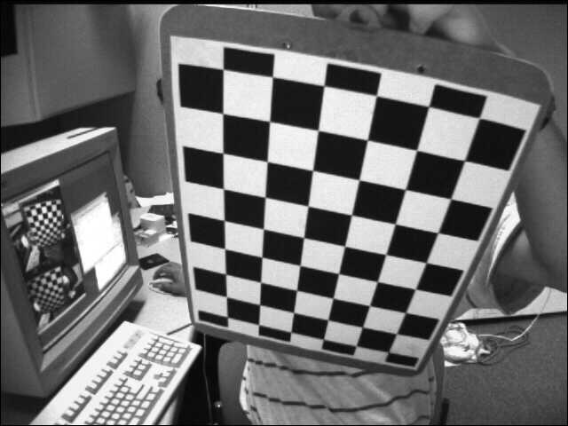
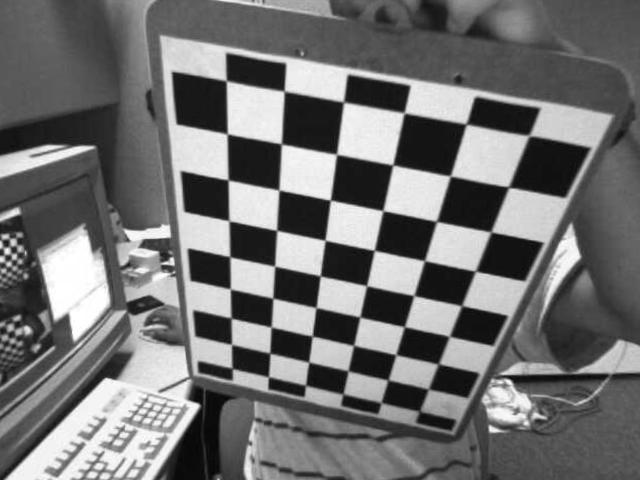
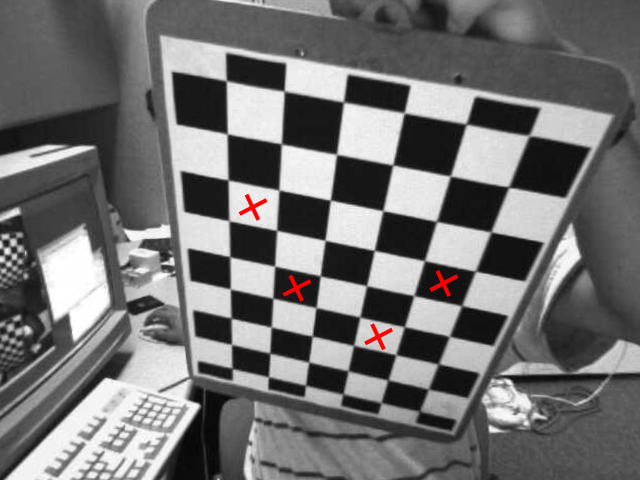

## ДЗ 4: 3D реконструкция

#### Описание алгоритма

1. Рассмотрим следующее изображение.

2. Уберем искажение с изображения шахматной доски с помощью калибровки камеры.

3. Отметим крестиками места, где впоследствии будут стоять фигуры.

4. С помощью `cv2.matchTemplate` найдем позиции крестиков на изображении.

5. Найдём квадранты сетки, где лежат крестики, и построим на них красные 3D конусы.

Ещё примеры:

